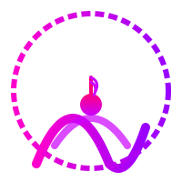
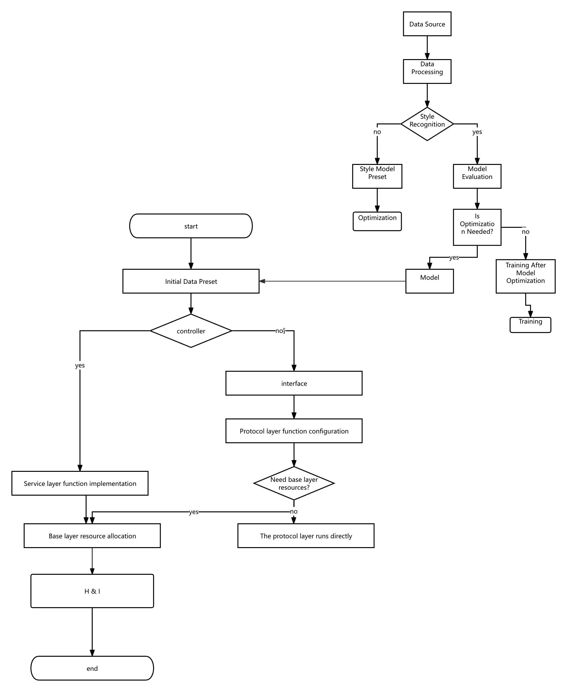

  

Tempo is a decentralized Web3-based project dedicated to redefining the creation, distribution, and value allocation of dance videos through music-driven AI dance generation technology. We are buildin[...]

## 1. Project Vision and Mission

### 1.1 Core Web3 Creative Philosophy

- **Open Creation**: Eliminate the high barriers of traditional dance video production with decentralized tools.  
- **Transparency**: Record the creation and distribution history of music, dance models, and videos on the blockchain.  
- **Ownership**: Ensure musicians, dancers, and AI contributors retain control and value over their work.  
- **Collaboration**: Foster seamless resonance among cross-disciplinary creators.  
- **Value Sharing**: Equitably distribute the value generated from dance video creation and consumption to all participants.

### 1.2 Tempo’s Innovative Positioning

Tempo merges music-driven dance video generation with Web3 technology, pioneering new scenarios:  

- Transition from centralized choreography tools to decentralized AI-driven creation.  
- Shift from single copyright ownership to multi-party collaborative dynamic NFT ownership.  
- Move from closed platform distribution to an open decentralized marketplace.

## 2. Technical Architecture

### 2.1 Multi-Layer Protocol Architecture

Flowchart

### 2.2 Privacy and Security Technologies

- **Federated Learning**: Train dance generation models without sharing raw data.  
- **Zero-Knowledge Proofs (ZKPs)**: Verify data origins and copyright compliance.  
- **Secure Multi-Party Computation (MPC)**: Enable collaborative video generation without exposing inputs.  
- **Homomorphic Encryption**: Run AI models on encrypted music data.  
- **Trusted Execution Environments (TEEs)**: Provide hardware-level protection for sensitive computations.

### 2.3 Data Types and Standardization

- **Music Data**: MIDI files, audio waveforms, beat and melody metadata.  
- **Motion Data**: 3D motion capture, skeletal animations, dance pose sequences.  
- **Video Data**: Generated dance video clips, rendering parameters.  
- **User Preference Data**: Style selections, rhythm preferences, dance types.

### 2.4 On-Chain/Off-Chain Structure

- **On-Chain**: Metadata, access control, copyright credentials, value allocation.  
- **Off-Chain**: High-bandwidth storage (IPFS), AI computation, real-time stream processing.

## 3. Core Innovative Features

### 3.1 Decentralized Dance Generation Protocol (RDGP)

Allows users to upload music and generate customized dance videos:  

#### Key Components:

- Music Analysis Module: Extracts rhythm, emotion, and style.  
- AI Dance Generator: Generates motion based on GANs and diffusion models.  
- Community Validation: Records copyright and quality on-chain.

#### Process:

1. Upload music and select style.  
2. AI generates video on decentralized nodes.  
3. Community validates and mints dynamic NFTs.  
4. Value is distributed to contributors.

### 3.2 Music and Dance NFT Marketplace

#### Features:

- Dynamic NFTs: Evolve with music updates.  
- Tiered Access: Previews, full videos, editable versions.  
- Copyright Traceability: Smart contracts ensure revenue splits.

### 3.3 Decentralized Creative Funding (Tempo Fund)

- **Funding Sources**: DAO donations, micropayments, NFT revenue shares.  
- **Mechanism**: Outcome-based rewards, crowdfunding for niche creations.

### 3.4 Dance Computation Marketplace (Tempo Compute)

#### Functions:

- Privacy-preserving computation network.  
- Trading algorithm NFTs.  
- Dynamic pricing based on complexity and resolution.

### 3.5 Creative Reputation System (Tempo Rep)

- **Reputation Sources**: Music quality, model contributions, validation participation.  
- **Applications**: Priority dataset access, governance weight.

## 4. Token Economics

### 4.1 $Tempo Utility

- **Access Rights**: Use generation and marketplace services.  
- **Governance Rights**: Participate in protocol decisions.  
- **Staking Rewards**: Support compute nodes for rewards.  
- **Payments**: Fees for generation, storage, and computation.

### 4.2 Token Distribution

- **Total Supply**: 1 billion $Tempo  
- **Allocation**:  
  - 30% Ecosystem and Creative Fund  
  - 20% Team (4-year vesting)  
  - 15% Early Contributors  
  - 20% Public Sale  
  - 10% Liquidity  
  - 5% Airdrop

### 4.3 Dynamic Mechanisms

- **Creation Incentives**: High-quality videos trigger rewards.  
- **Value Recapture**: NFT fees fund buyback and burn.  
- **Deflationary Pressure**: Service fees burned.

## 5. Ecosystem Participants

- **Music Creators**: Upload music for profit.  
- **Dance Enthusiasts**: Provide motions or validate content.  
- **AI Developers**: Train models and sell algorithms.  
- **Audiences**: Consume videos and fund creators.  
- **Validators**: Ensure quality for rewards.

## 6. Technical Roadmap

- **Phase 1 (0-6 Months)**: Core protocol, Alpha version generation.  
- **Phase 2 (7-12 Months)**: NFT marketplace and privacy computation, Beta launch.  
- **Phase 3 (13-18 Months)**: Full platform and funding mechanism.  
- **Phase 4 (19-24 Months)**: VR experience and global expansion.

## 7. Conclusion

Tempo brings music and dance creation into the Web3 era, empowering every rhythm maker with decentralized technology and AI. We are more than a protocol—we are a creative revolution, building an open and collaborative future for digital dance content.

This translation maintains the structure and intent of the original text while ensuring clarity and natural flow in English. Let me know if you need further adjustments!
