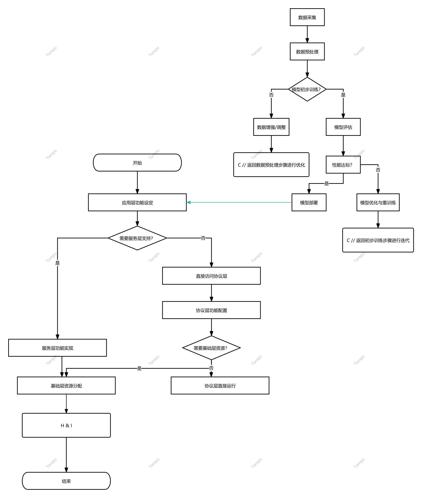

Tempo 是一个基于 Web3 的去中心化项目，致力于通过音乐驱动的 AI 舞蹈生成技术，重新定义舞蹈视频的创作、分发和价值分配方式。我们构建了一个无需许可的创意生态系统，让音乐创作者、舞蹈爱好者、AI 开发者和观众能够以安全、透明和公平的方式协作。通过结合区块链、隐私计算和生成式 AI，Tempo 将解锁音乐与舞蹈融合的新范式，同时保障创作者的数据主权和收益分享。
1. 项目愿景与使命
1.1 Web3 创意核心理念
- 开放创作: 消除传统舞蹈视频制作的高门槛，提供去中心化工具。  
- 透明性: 通过区块链记录音乐、舞蹈模型和视频的创作与分发历程。  
- 所有权: 确保音乐家、舞者和 AI 贡献者对其作品保持控制权和价值。  
- 协作性: 促进跨领域创作者的无缝共振。  
- 价值共享: 将舞蹈视频生成和消费产生的价值公平分配给所有参与者。
1.2 Tempo 的创新定位
Tempo 将音乐驱动舞蹈视频生成与 Web3 技术融合，开创全新场景：  
- 从中心化编舞工具转向去中心化的 AI 驱动创作。  
- 从单一版权归属转向多方协作的动态 NFT 所有权。  
- 从封闭平台分发转向开放的去中心化市场。
2. 技术架构
2.1 多层协议架构

2.2 隐私与安全技术
- 联邦学习: 在不共享原始数据的情况下训练舞蹈生成模型。  
- 零知识证明 (ZKPs): 验证数据来源和版权合规性。  
- 安全多方计算 (MPC): 允许多方协作生成视频而不暴露输入。  
- 同态加密: 在加密音乐数据上运行 AI 模型。  
- 可信执行环境 (TEEs): 为敏感计算提供硬件保护。
2.3 数据类型与标准化
- 音乐数据: MIDI 文件、音频波形、节拍与旋律元数据。  
- 动作数据: 3D 动作捕捉、骨骼动画、舞蹈姿势序列。  
- 视频数据: 生成的舞蹈视频片段、渲染参数。  
- 用户偏好数据: 风格选择、节奏偏好、舞蹈类型。
2.4 链上/链下结构
- 链上: 元数据、访问控制、版权凭证、价值分配。  
- 链下: 高带宽存储 (IPFS)、AI 计算、实时流处理。
3. 核心创新功能
3.1 去中心化舞蹈生成协议 (RDGP)
允许用户上传音乐生成定制化舞蹈视频：  
- 关键组件:  
  - 音乐分析模块：提取节奏、情感和风格。  
  - AI 舞蹈生成器：基于 GAN 和扩散模型生成动作。  
  - 社区验证：链上记录版权和质量。
- 流程:  
  1. 上传音乐并选择风格。  
  2. AI 在去中心化节点生成视频。  
  3. 社区验证后铸造动态 NFT。  
  4. 价值分配给贡献者。
3.2 音乐与舞蹈 NFT 市场
- 特点:  
  - 动态 NFT：随音乐更新而变化。  
  - 分层访问：预览、完整视频、可编辑版本。  
  - 版权追溯：智能合约保障收益分成。
3.3 去中心化创意资助 (Tempo Fund)
- 资金来源: DAO 捐款、微支付、NFT 分成。  
- 机制: 成果奖励、众筹支持小众创作。
3.4 舞蹈计算市场 (Tempo Compute)
- 功能:  
  - 隐私保护计算网络。  
  - 交易算法 NFT。  
  - 动态定价基于复杂度和分辨率。
3.5 创意声誉系统 (Tempo Rep)
- 声誉来源: 音乐质量、模型贡献、验证参与。  
- 应用: 优先访问数据集、治理权重。
4. 代币经济学
4.1 $Tempo 效用
- 访问权: 使用生成和市场服务。  
- 治理权: 参与协议决策。  
- 质押收益: 支持计算节点获奖励。  
- 支付: 生成、存储和计算费用。
4.2 代币分配
- 总供应量：10 亿 $Tempo  
- 分配：  
  - 30% 生态与创意基金  
  - 20% 团队（4 年解锁）  
  - 15% 早期贡献者  
  - 20% 公开销售  
  - 10% 流动性  
  - 5% 空投
4.3 动态机制
- 创作激励: 高质量视频触发奖励。  
- 价值回流: NFT 费用回购销毁。  
- 通缩压力: 服务费用燃烧。
5. 生态系统参与者
- 音乐创作者: 上传音乐获利。  
- 舞蹈爱好者: 提供动作或验证。  
- AI 开发者: 训练模型并出售算法。  
- 观众: 消费视频并资助。  
- 验证者: 确保质量获奖励。
6. 技术实现路线图
- 阶段一（0-6 个月）: 基础协议，Alpha 版生成。  
- 阶段二（7-12 个月）: NFT 市场和隐私计算，Beta 上线。  
- 阶段三（13-18 个月）: 完整平台与资助机制。  
- 阶段四（19-24 个月）: VR 体验与全球扩展。
7. 结论
Tempo 将音乐与舞蹈的创作带入 Web3 时代，用去中心化技术和 AI 赋能每一位节奏缔造者。我们不仅是一个协议，更是一场创意革命，构建一个开放、公平的节奏元宇宙。